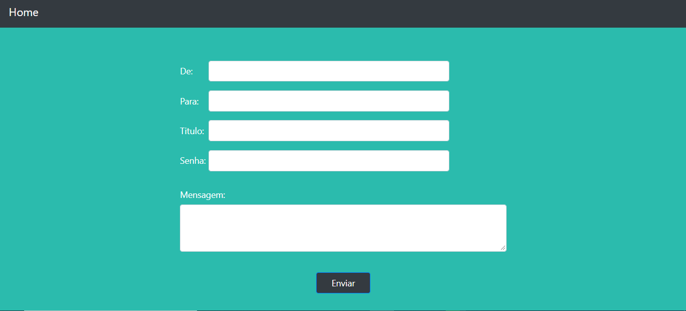
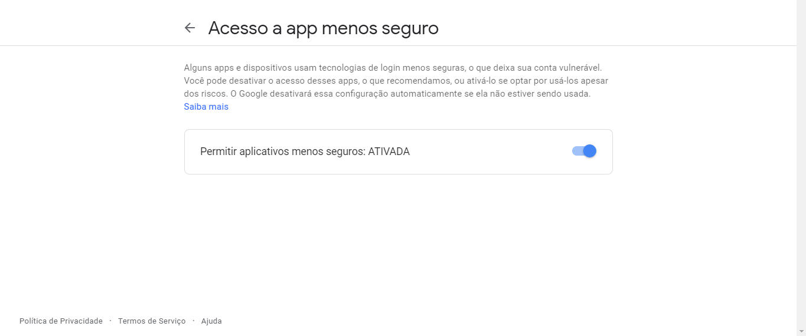

# App-Envia-Email

Aplicação Web feita em Java para envio de Email

# OBS:
  - **O servidor SMTP utilizado: `smtp.gmail.com`**
  - **O campo `De` precisar ser um Email cadastro no Gmail**
  - **Precisa ativar a opção [`Acesso a app menos seguro`](https://myaccount.google.com/lesssecureapps) para a aplicação se conectar com o servidor smtp do Gmail**
      
      
